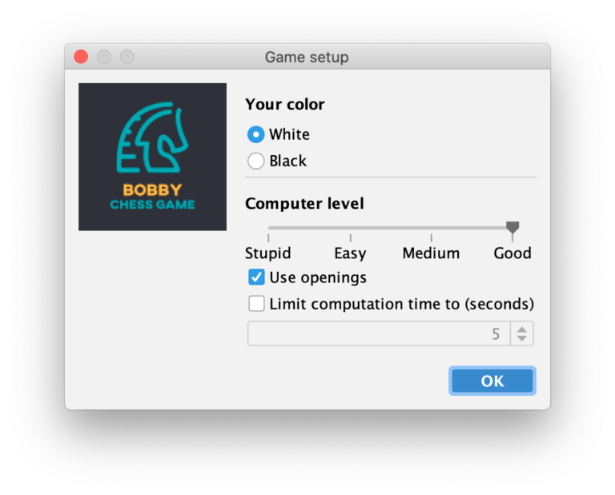
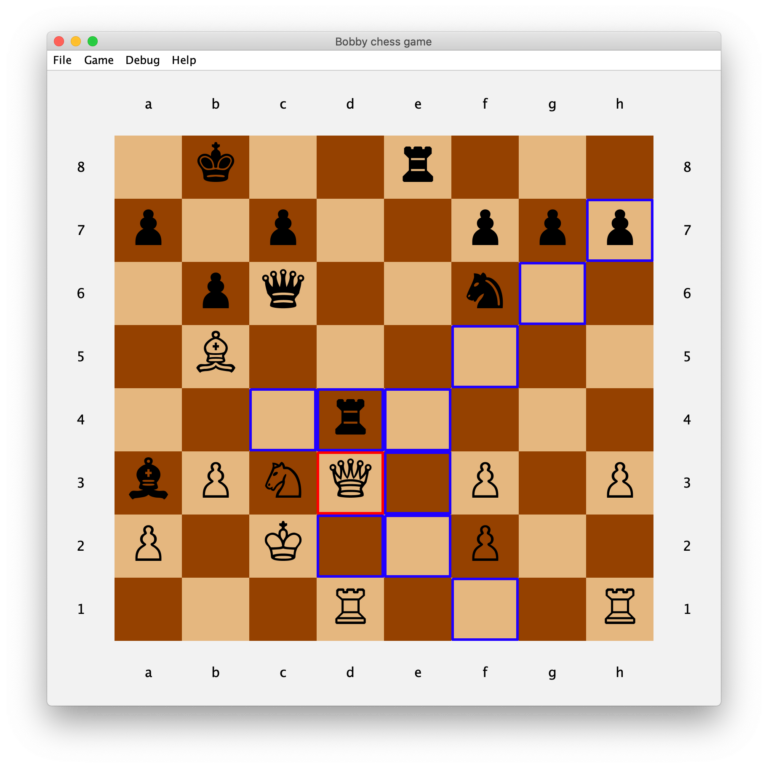

# Bobby

[](https://github.com/teemoo7/bobby/actions/workflows/build.yml) [](https://sonarcloud.io/dashboard?id=ch.teemoo%3Abobby) [](https://sonarcloud.io/dashboard?id=ch.teemoo%3Abobby)

---

:boom: **Try it on [Lichess](https://lichess.org/@/bobby-bot)**! :boom:

---

This basic Chess game is a humble tribute to famous Chess player [Robert James "Bobby" Fischer](https://en.wikipedia.org/wiki/Bobby_Fischer), World Chess Champion.

Note that the author does not agree with Fischer's political and religious opinions, but remains a fan of his genius at Chess.


**Note:** requires Java 17

## About Bobby

If you are interested in how this engine works, please have a look at those two articles by the author:

1. [Implementing a Chess engine from scratch](https://towardsdatascience.com/implementing-a-chess-engine-from-scratch-be38cbdae91?source=friends_link&sk=ebc15d3d963f1e61ca1bfe7961afdcad)
2. [Enhancing a Java Swing App to a clean, elegant Web App without changing the code](https://codeburst.io/enhancing-a-java-swing-app-to-a-clean-elegant-web-app-without-changing-the-code-a69d7c1c2781?source=friends_link&sk=952623a093a6bed7870746b52719ef88)





## How to launch

### From a released JAR

1. If not already done, you can install OpenJDK 17 for free (see the excellent distributions of [Temurin by Adoptium](https://adoptium.net/temurin/releases/?version=17))
2. Download the [latest release JAR](https://github.com/teemoo7/bobby/releases/download/bobby-0.1/bobby-0.1.jar)
3. Then launch the downloaded JAR
    ```
    java -jar bobby-0.1.jar 
    ```
 
### From source code

1. Checkout the code
2. Build it with maven
    ```
     mvn package -Dmaven.test.skip=true
    ```
3. Launch the created JAR
    ```
    java -jar target/bobby-1.0-SNAPSHOT.jar 
    ```

### Online (deprecated)

#### Lichess Bot (deprecated)

Thanks to the great lib [Chariot](https://github.com/tors42/chariot), it was possible to play against Bobby on Lichess.

Just browse to [bobby-bot profile on Lichess.org](https://lichess.org/@/bobby-bot) and challenge it! If the server is running, the bot will accept the challenge and play.

However, the bot has been stopped for costs reasons.

#### GUI in browser (deprecated)

There was a browser version of the game (limited to one single user at a time), but it was stopped for costs reasons.

## Features

### Game

* AI with multiple strength level, from random-stupid to 3-depths computation, using a minimax algorithm
* All moves implemented
* Change GUI view according to selected color
* Draw proposals
* Undo last move
* Suggest move
* Usage of 15+ famous openings
* Limit computation time to _n_ seconds
* Save game to and load from text files with basic notation
* Load PGN file
* AI is as arrogant as the real Bobby was :smile:

### Technical

* Uses Java 17
* Ability to use bundled light JRE ([doc here](PACKAGE.md))
* Strong code coverage, incl. GUI testing
* Code style with Checkstyle, code quality with SpotBugs and SonarSource
* Pipeline with GitHub Actions
* Uses a nice modern Look & Feel [FlatLaf](https://github.com/JFormDesigner/FlatLaf) for all platforms
* Uses free font _FreeSerif_ in order to have a nice rendering of chess pieces

## Limitations

### Computation time

The implemented AI works uses a depth-first computation, which means that if the computation time is restricted, it may not evaluate every single possible move: it evaluates as deep as possible a first move, then a second, etc, but has no guarantee to cover every move of the first depth.
